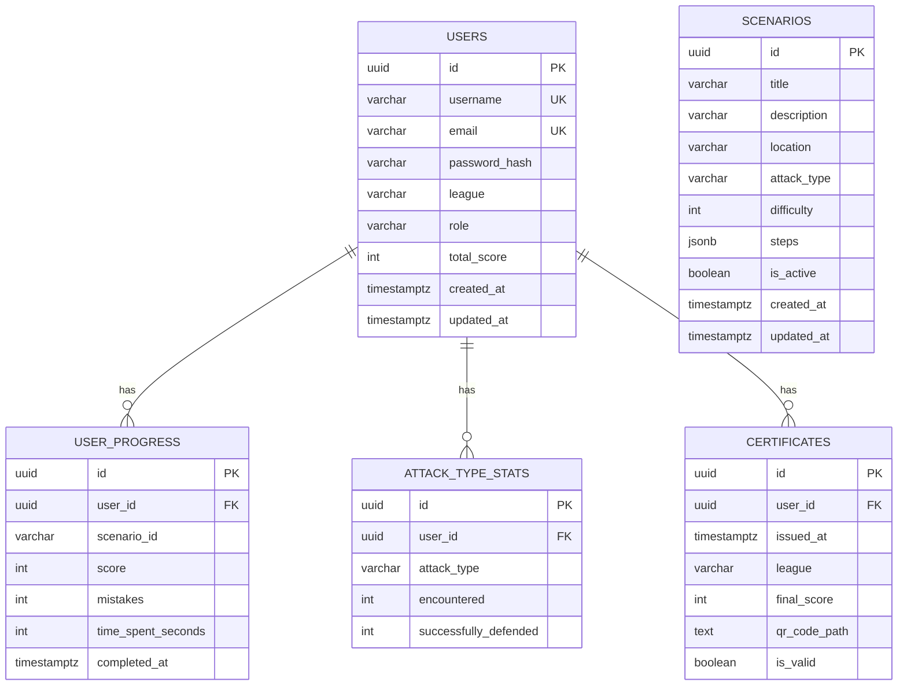

# CyberSim — Образовательный симулятор кибербезопасности

> **Кейс «Центр-инвест»** — Интерактивный веб-симулятор для повышения цифровой грамотности и безопасности

[](LICENSE)
[](https://www.rust-lang.org/)
[](https://nextjs.org/)
[](https://www.postgresql.org/)
[](https://www.docker.com/)

---

## Ссылка на веб приложение - https://cyber-sim.online

## 🎯 О проекте

CyberSim — интерактивный веб-симулятор, в котором пользователь попадает в реалистичную среду (почта, соцсети, мессенджеры) и сталкивается с реальными сценариями кибератак. Вместо скучных инструкций — эмоциональный опыт: когда пользователь «теряет» аккаунт из-за фишинговой ссылки, нейронные связи формируются глубже, чем при чтении текста.

### Ключевые особенности

- 🎭 **Нарративные сценарии** — 3 локации (Офис, Дом, Public Wi-Fi), 9 типов атак, 10+ сюжетных линий
- 🛡️ **Обучение через действие** — после каждой ошибки показывается анимация последствий взлома + пошаговый алгоритм правильной защиты
- 📊 **Система прогресса** — шкала безопасности (HP 0-100), лиги (новичок → эксперт), таблица лидеров
- 🔐 **Сертификаты** — верифицированные сертификаты с QR-кодом и PDF-экспортом
- 💻 **Security Terminal** — интерактивный терминал для практики команд безопасности (`whois`, `nslookup`, `check-url`, `check-email`)
- 📋 **Security Report** — персональный PDF-отчёт с radar-чартом уязвимостей и рекомендациями
- 👑 **Админ-панель** — управление пользователями, сертификатами, импорт сценариев, аналитика

---

## 🚀 Быстрый запуск

### Docker Compose (рекомендуется)

```bash
docker-compose up --build
```

Откройте **http://localhost:3000** в браузере.

### Локальная разработка

**Требования:**
- Rust 1.75+
- Node.js 20+
- PostgreSQL 16
- Redis 7

```bash
# База данных и Redis
docker-compose up -d postgres redis

# Бэкенд
cd backend/backend
cargo run

# Фронтенд (в другом терминале)
npm install
npm run dev
```

---

## 📦 Стек технологий

| Компонент | Технология |
|---|---|
| **Фронтенд** | Next.js 16, React 19, TypeScript, Material UI v7, Zustand |
| **Бэкенд** | Rust, Axum 0.7, SQLx, Argon2, JWT, utoipa (Swagger) |
| **База данных** | PostgreSQL 16 |
| **Кэш** | Redis 7 |
| **Контейнеризация** | Docker, Docker Compose |
| **PDF** | jsPDF + html2canvas |

---

## 🏗 Архитектура

```
┌─────────────────┐     HTTP/JSON      ┌──────────────────┐
│   Next.js 16    │ ◄────────────────► │   Rust Backend   │
│   Frontend      │     :3000          │     :8000        │
│  (Turbopack)    │                    │   (Axum + SQLx)  │
└────────┬────────┘                    └────────┬─────────┘
         │                                      │
         │                                      │
    ┌────┴────┐                    ┌────────────┼────────────┐
    │ Swagger │                    ▼            ▼            ▼
    │  /docs  │              ┌────────┐  ┌────────┐  ┌────────┐
    └─────────┘              │PostgreSQL│  │ Redis  │  │  FS    │
                             │  :5432  │  │ :6379  │  │ (QR)   │
                             └────────┘  └────────┘  └────────┘
```

---

## 🔌 API Endpoints

### Auth
| Метод | Путь | Описание | Auth |
|---|---|---|---|
| POST | `/api/v1/auth/register` | Регистрация | ❌ |
| POST | `/api/v1/auth/login` | Вход | ❌ |
| GET | `/api/v1/auth/me` | Текущий пользователь | ✅ |

### Progress
| Метод | Путь | Описание | Auth |
|---|---|---|---|
| GET | `/api/v1/progress` | Прогресс пользователя | ✅ |
| POST | `/api/v1/progress/scenarios/:id/complete` | Завершение сценария | ✅ |

### Leaderboard
| Метод | Путь | Описание | Auth |
|---|---|---|---|
| GET | `/api/v1/leaderboard?limit=50` | Таблица лидеров | ✅ |

### Certificates
| Метод | Путь | Описание | Auth |
|---|---|---|---|
| POST | `/api/v1/certificates` | Создать сертификат | ✅ |
| GET | `/api/v1/certificates` | Мои сертификаты | ✅ |
| GET | `/api/v1/certificates/:id/qr.png` | QR-код сертификата | ❌ |
| GET | `/api/v1/verify/:user_id/:score` | Верификация сертификата | ❌ |

### Admin
| Метод | Путь | Описание | Auth |
|---|---|---|---|
| GET | `/api/v1/admin/stats` | Общая статистика | 🔒 Admin |
| GET | `/api/v1/admin/users` | Список пользователей | 🔒 Admin |
| GET | `/api/v1/admin/users/:id` | Детали пользователя | 🔒 Admin |
| PATCH | `/api/v1/admin/users/:id` | Обновить пользователя | 🔒 Admin |
| DELETE | `/api/v1/admin/users/:id` | Удалить пользователя | 🔒 Admin |
| POST | `/api/v1/admin/users/bulk` | Массовая операция | 🔒 Admin |
| GET | `/api/v1/admin/certificates` | Список сертификатов | 🔒 Admin |
| DELETE | `/api/v1/admin/certificates/:id` | Удалить сертификат | 🔒 Admin |
| PATCH | `/api/v1/admin/certificates/:id/revoke` | Отозвать сертификат | 🔒 Admin |
| POST | `/api/v1/admin/scenarios/import` | Импорт сценария | 🔒 Admin |
| GET | `/api/v1/admin/scenarios` | Список сценариев | 🔒 Admin |
| DELETE | `/api/v1/admin/scenarios/:id` | Удалить сценарий | 🔒 Admin |

### Documentation
| Путь | Описание |
|---|---|
| `/docs` | Swagger UI (интерактивная документация) |
| `/api-docs/openapi.json` | OpenAPI спецификация |

---

## 🗄 Схема базы данных



---

## 🎮 Функционал

### Сценарии обучения
- **3 локации**: Офис, Дом, Общественный Wi-Fi
- **9 типов атак**: фишинг, скимминг, подбор пароля, соц. инженерия, дипфейк, вредоносное ПО, MITM, SMS-фишинг, программы-вымогатели
- **10+ сценариев** с нарративной составляющей

### Обучение через действие
- **Анимация последствий взлома** — CSS-анимация с пошаговым показом последствий ошибки
- **«Как правильно»** — после каждой ошибки появляется подробный алгоритм правильной защиты
- **Подсказки** — контекстные подсказки при затруднении
- **Ссылки на OWASP/CWE** — профессиональные ресурсы для углублённого изучения

### Геймификация
- **Система лиг**: beginner → intermediate → advanced → expert
- **Шкала безопасности** (HP 0-100) — снижается при ошибках, повышается при верных решениях
- **Таблица лидеров** с Redis кэшированием
- **Streak-система** — бонус за серии правильных ответов

### Security Terminal
- Интерактивный терминал для практики команд безопасности
- Команды: `check-url`, `check-email`, `whois`, `nslookup`, `ping`, `decode`, `hash`, `scan`, `traceroute`
- Быстрые команды для демонстрации

### Security Report
- Персональный PDF-отчёт с radar-чартом уязвимостей
- Анализ слабых и сильных сторон по типам атак
- Персональные рекомендации
- Экспорт в PDF одним кликом

### Админ-панель
- **Дашборд** — статистика, графики, топ пользователей
- **Пользователи** — CRUD, массовые операции (смена лиги/роли, удаление)
- **Сертификаты** — просмотр, отзыв, удаление
- **Импорт сценариев** — добавление новых сценариев через JSON API

---

## 🖥 Скриншоты

### Дашборд
Главная страница со сценариями обучения.

### Security Terminal
Интерактивный терминал для практики команд безопасности.

### Админ-панель
Управление пользователями, сертификатами и аналитика.

### Security Report
Персональный PDF-отчёт с radar-чартом уязвимостей.

---

## 🛡️ Безопасность

- **Argon2** — хеширование паролей (рекомендация OWASP)
- **JWT** — аутентификация с expiration
- **Middleware** — проверка ролей на каждом защищённом эндпоинте
- **CORS** — настройка разрешённых origins
- **SQLx** — параметризованные запросы (защита от SQL-инъекций)
- **Без реальных вредоносных файлов** — все угрозы симулированы на уровне интерфейса

---

## 📋 Критерии соответствия ТЗ

| Требование | Статус |
|---|---|
| Нарративные сценарии (3+ уровней, 5+ атак) | ✅ 3 локации, 9 атак, 10+ сценариев |
| Модуль «Выбор действия» | ✅ Интерактивные карточки с 3-4 вариантами |
| Прогресс-модуль (HP/репутация) | ✅ Шкала безопасности 0-100 |
| Личный кабинет + статистика | ✅ Profile, Stats, Leaderboard |
| Кроссплатформенность | ✅ Веб-приложение, работает в Chrome/Yandex |
| Автономность (docker-compose up) | ✅ Одна команда |
| Безопасность (без реальных вредоносов) | ✅ Симуляция на уровне UI |
| Хранение данных + хеширование | ✅ PostgreSQL + Argon2 |
| Модульная архитектура | ✅ Разделение handlers/services/middleware |
| ER-диаграмма | ✅ Mermaid в README |
| Swagger/OpenAPI | ✅ `/docs` |
| Анимация последствий взлома | ✅ HackAnimation компонент |
| Обучение правильному алгоритму | ✅ «Как правильно» блок после ошибки |
| Рейтинги + сертификация | ✅ Лиги, лидерборд, QR-сертификаты |
| Админ-панель | ✅ Полный CRUD + аналитика |

---

## 🗺 Roadmap

### Реализовано
- ✅ Нарративные сценарии
- ✅ Анимация последствий взлома
- ✅ Обучающие блоки «Как правильно»
- ✅ Security Terminal
- ✅ Security PDF Report
- ✅ Админ-панель с аналитикой
- ✅ Импорт сценариев через API
- ✅ ER-диаграмма
- ✅ Swagger/OpenAPI документация

### В планах
- 🔲 WebSocket реалтайм уведомления
- 🔲 TLS 1.2/1.3 (HTTPS) для production
- 🔲 Голосовая социальная инженерия (аудио-сценарии)
- 🔲 Режим «Команда» — совместное прохождение
- 🔲 CTF мини-игры
- 🔲 Импорт реальных фишинговых кейсов из APWG

## 📄 Лицензия

MIT — Образовательный проект для хакатона «Центр-инвест»

---

> **CyberSim © 2026** — Формируем устойчивые поведенческие паттерны безопасного поведения через эмоциональный опыт.
